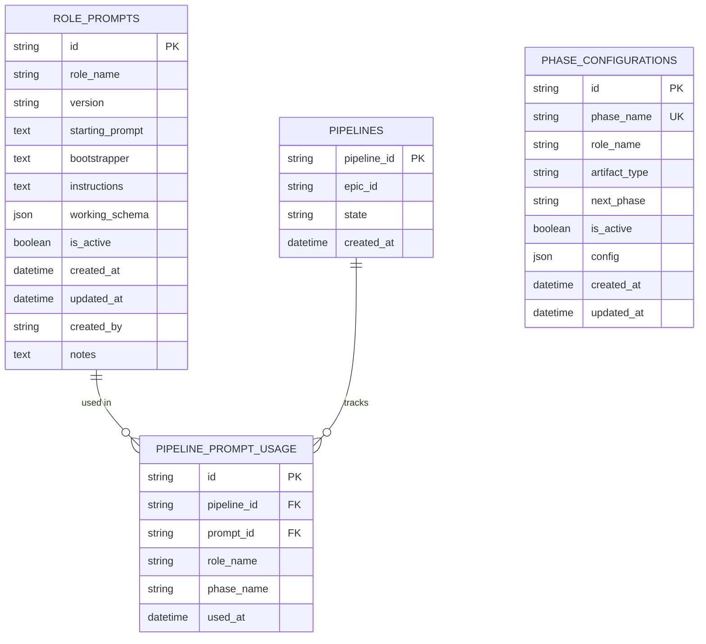

# PIPELINE-175A: Architecture Document

**Epic:** PIPELINE-175A - Data-Described Pipeline Infrastructure  
**Phase:** Architecture Design  
**Architect Mentor:** Complete  
**Version:** 1.0  
**Date:** 2025-12-04

---

## Table of Contents

1. [Architecture Overview](#architecture-overview)
2. [Database Schema Design](#database-schema-design)
3. [Repository Layer](#repository-layer)
4. [Service Layer](#service-layer)
5. [Seed Scripts](#seed-scripts)
6. [Integration Points](#integration-points)
7. [Error Handling](#error-handling)
8. [Performance Considerations](#performance-considerations)
9. [Testing Strategy](#testing-strategy)

---

## Architecture Overview

### System Components

```
┌─────────────────────────────────────────────────────────────┐
│                     PIPELINE-175A Architecture              │
├─────────────────────────────────────────────────────────────┤
│                                                             │
│  ┌──────────────┐         ┌──────────────────┐            │
│  │   Seed       │────────▶│   Database       │            │
│  │   Scripts    │         │   (SQLite/PG)    │            │
│  └──────────────┘         └──────────────────┘            │
│         │                          │                        │
│         │                          ▼                        │
│         │                 ┌─────────────────┐              │
│         │                 │  Repositories   │              │
│         │                 │  - RolePrompt   │              │
│         │                 │  - PhaseConfig  │              │
│         │                 │  - PromptUsage  │              │
│         │                 └─────────────────┘              │
│         │                          │                        │
│         │                          ▼                        │
│         │                 ┌─────────────────┐              │
│         └────────────────▶│ RolePrompt      │              │
│                           │ Service         │              │
│                           └─────────────────┘              │
│                                    │                        │
│                                    ▼                        │
│                           (Used by 175B)                    │
│                           PhaseExecutorService              │
└─────────────────────────────────────────────────────────────┘
```

### Design Principles

1. **Data-Driven Configuration** - All role prompts and phase flow stored in database
2. **Zero Behavior Changes** - PIPELINE-150 functionality unchanged
3. **Repository Pattern** - Clean separation between data access and business logic
4. **Idempotent Operations** - All seed scripts safe to re-run
5. **Performance First** - All operations <100ms with proper indexing

---

## Database Schema Design

### Entity Relationship Diagram



### Table: role_prompts

**Purpose:** Store role prompt templates with versioning and audit trail

**Schema:**

```sql
CREATE TABLE role_prompts (
    id VARCHAR(64) PRIMARY KEY,                    -- Format: rp_<uuid>
    role_name VARCHAR(64) NOT NULL,                -- Role identifier (pm, architect, etc.)
    version VARCHAR(16) NOT NULL,                  -- Semantic version (1.0, 1.1, 2.0)
    starting_prompt TEXT,                          -- Optional opening context
    bootstrapper TEXT NOT NULL,                    -- Role identity/framing
    instructions TEXT NOT NULL,                    -- Detailed role instructions
    working_schema JSON,                           -- Expected schemas
    is_active BOOLEAN NOT NULL DEFAULT TRUE,       -- Only one active per role
    created_at TIMESTAMP WITH TIME ZONE NOT NULL,
    updated_at TIMESTAMP WITH TIME ZONE NOT NULL,
    created_by VARCHAR(128),                       -- Creator identifier
    notes TEXT                                     -- Version changelog
);

-- Indexes
CREATE INDEX idx_role_prompts_role ON role_prompts(role_name);
CREATE INDEX idx_role_prompts_active ON role_prompts(is_active);
CREATE INDEX idx_role_prompts_role_active ON role_prompts(role_name, is_active);

-- PostgreSQL: Partial unique constraint (only one active per role)
CREATE UNIQUE INDEX idx_role_prompts_unique_active 
ON role_prompts (role_name) 
WHERE is_active = TRUE;
```

**Field Descriptions:**

| Field | Type | Constraint | Description |
|-------|------|------------|-------------|
| id | VARCHAR(64) | PK | Unique identifier, format: `rp_<uuid>` |
| role_name | VARCHAR(64) | NOT NULL, Indexed | Role identifier: pm, architect, ba, dev, qa, commit |
| version | VARCHAR(16) | NOT NULL | Semantic version: 1.0, 1.1, 2.0 |
| starting_prompt | TEXT | Nullable | Optional opening context for prompt |
| bootstrapper | TEXT | NOT NULL | Role identity and framing (who am I?) |
| instructions | TEXT | NOT NULL | Detailed instructions (what do I do?) |
| working_schema | JSON | Nullable | Expected input/output schemas |
| is_active | BOOLEAN | NOT NULL, Indexed | Only one active version per role |
| created_at | TIMESTAMP | NOT NULL | Creation timestamp (UTC) |
| updated_at | TIMESTAMP | NOT NULL | Last modification timestamp (UTC) |
| created_by | VARCHAR(128) | Nullable | Creator identifier (user ID or "system") |
| notes | TEXT | Nullable | Version changelog/notes |

**Constraints:**

- **Primary Key:** `id`
- **Unique (Partial):** Only one row per `role_name` where `is_active = TRUE`
- **Check:** `bootstrapper` and `instructions` must be non-empty

---

### Table: phase_configurations

**Purpose:** Define pipeline flow as data (state machine configuration)

**Schema:**

```sql
CREATE TABLE phase_configurations (
    id VARCHAR(64) PRIMARY KEY,                    -- Format: pc_<uuid>
    phase_name VARCHAR(64) NOT NULL UNIQUE,        -- Phase identifier
    role_name VARCHAR(64) NOT NULL,                -- Which role executes
    artifact_type VARCHAR(64) NOT NULL,            -- Expected output
    next_phase VARCHAR(64),                        -- Next phase (null = terminal)
    is_active BOOLEAN NOT NULL DEFAULT TRUE,
    config JSON,                                   -- Phase-specific settings
    created_at TIMESTAMP WITH TIME ZONE NOT NULL,
    updated_at TIMESTAMP WITH TIME ZONE NOT NULL
);

-- Indexes
CREATE INDEX idx_phase_config_phase ON phase_configurations(phase_name);
CREATE INDEX idx_phase_config_active ON phase_configurations(is_active);
```

**Field Descriptions:**

| Field | Type | Constraint | Description |
|-------|------|------------|-------------|
| id | VARCHAR(64) | PK | Unique identifier, format: `pc_<uuid>` |
| phase_name | VARCHAR(64) | NOT NULL, UNIQUE | Phase identifier: pm_phase, arch_phase, etc. |
| role_name | VARCHAR(64) | NOT NULL | Role that executes this phase |
| artifact_type | VARCHAR(64) | NOT NULL | Expected artifact output: epic, arch_notes, etc. |
| next_phase | VARCHAR(64) | Nullable | Next phase in sequence (null = terminal phase) |
| is_active | BOOLEAN | NOT NULL | Whether this config is active |
| config | JSON | Nullable | Phase-specific configuration (timeouts, retries) |
| created_at | TIMESTAMP | NOT NULL | Creation timestamp (UTC) |
| updated_at | TIMESTAMP | NOT NULL | Last modification timestamp (UTC) |

**Constraints:**

- **Primary Key:** `id`
- **Unique:** `phase_name`
- **Check:** `phase_name`, `role_name`, `artifact_type` must be non-empty

---

### Table: pipeline_prompt_usage

**Purpose:** Audit trail of which prompt versions were used in which pipelines

**Schema:**

```sql
CREATE TABLE pipeline_prompt_usage (
    id VARCHAR(64) PRIMARY KEY,                    -- Format: ppu_<uuid>
    pipeline_id VARCHAR(64) NOT NULL,              -- FK to pipelines
    prompt_id VARCHAR(64) NOT NULL,                -- FK to role_prompts
    role_name VARCHAR(64) NOT NULL,                -- Role executed
    phase_name VARCHAR(64) NOT NULL,               -- Phase where used
    used_at TIMESTAMP WITH TIME ZONE NOT NULL      -- Usage timestamp
);

-- Indexes
CREATE INDEX idx_prompt_usage_pipeline ON pipeline_prompt_usage(pipeline_id);
CREATE INDEX idx_prompt_usage_prompt ON pipeline_prompt_usage(prompt_id);
CREATE INDEX idx_prompt_usage_role_phase ON pipeline_prompt_usage(role_name, phase_name);

-- Foreign Keys
ALTER TABLE pipeline_prompt_usage 
    ADD CONSTRAINT fk_prompt_usage_pipeline 
    FOREIGN KEY (pipeline_id) REFERENCES pipelines(pipeline_id);

ALTER TABLE pipeline_prompt_usage 
    ADD CONSTRAINT fk_prompt_usage_prompt 
    FOREIGN KEY (prompt_id) REFERENCES role_prompts(id);
```

**Field Descriptions:**

| Field | Type | Constraint | Description |
|-------|------|------------|-------------|
| id | VARCHAR(64) | PK | Unique identifier, format: `ppu_<uuid>` |
| pipeline_id | VARCHAR(64) | NOT NULL, FK | Pipeline that used the prompt |
| prompt_id | VARCHAR(64) | NOT NULL, FK | Prompt version that was used |
| role_name | VARCHAR(64) | NOT NULL | Role that was executed |
| phase_name | VARCHAR(64) | NOT NULL | Phase where prompt was used |
| used_at | TIMESTAMP | NOT NULL | When the prompt was used (UTC) |

**Constraints:**

- **Primary Key:** `id`
- **Foreign Key:** `pipeline_id` → `pipelines.pipeline_id`
- **Foreign Key:** `prompt_id` → `role_prompts.id`

---

### Migration Script

**File:** `app/orchestrator_api/persistence/migrations/001_create_role_prompt_tables.py`

```python
"""
Migration: Create role prompt and phase configuration tables.

Creates:
- role_prompts
- phase_configurations
- pipeline_prompt_usage
"""

from sqlalchemy import create_engine
from app.orchestrator_api.persistence.models import Base
from config import settings

def upgrade():
    """Create tables."""
    engine = create_engine(settings.DATABASE_URL)
    
    # Create tables
    Base.metadata.create_all(engine, tables=[
        Base.metadata.tables['role_prompts'],
        Base.metadata.tables['phase_configurations'],
        Base.metadata.tables['pipeline_prompt_usage'],
    ])
    
    print("✓ Created role_prompts table")
    print("✓ Created phase_configurations table")
    print("✓ Created pipeline_prompt_usage table")


def downgrade():
    """Drop tables."""
    engine = create_engine(settings.DATABASE_URL)
    
    Base.metadata.drop_all(engine, tables=[
        Base.metadata.tables['pipeline_prompt_usage'],
        Base.metadata.tables['phase_configurations'],
        Base.metadata.tables['role_prompts'],
    ])
    
    print("✓ Dropped pipeline_prompt_usage table")
    print("✓ Dropped phase_configurations table")
    print("✓ Dropped role_prompts table")


if __name__ == "__main__":
    import sys
    if len(sys.argv) > 1 and sys.argv[1] == "downgrade":
        downgrade()
    else:
        upgrade()
```

---

## Repository Layer

### RolePromptRepository

**File:** `app/orchestrator_api/persistence/repositories.py`

**Purpose:** CRUD operations for role prompts with versioning

**Interface:**

```python
class RolePromptRepository:
    """Repository for RolePrompt CRUD operations."""
    
    @staticmethod
    def get_active_prompt(role_name: str) -> Optional[RolePrompt]:
        """Get currently active prompt for a role."""
        
    @staticmethod
    def get_by_id(prompt_id: str) -> Optional[RolePrompt]:
        """Get specific prompt by ID."""
        
    @staticmethod
    def list_versions(role_name: str) -> List[RolePrompt]:
        """List all versions for a role, ordered by date desc."""
        
    @staticmethod
    def create(
        role_name: str,
        version: str,
        bootstrapper: str,
        instructions: str,
        starting_prompt: Optional[str] = None,
        working_schema: Optional[dict] = None,
        created_by: Optional[str] = None,
        notes: Optional[str] = None,
        set_active: bool = True
    ) -> RolePrompt:
        """Create new role prompt."""
        
    @staticmethod
    def set_active(prompt_id: str) -> RolePrompt:
        """Set specific prompt as active (deactivates others)."""
```

**Key Behaviors:**

- `get_active_prompt()` returns None if not found (doesn't raise)
- `create()` with `set_active=True` automatically deactivates other versions
- `set_active()` atomically switches active version (transaction)
- All methods handle session lifecycle (open, commit, close)

---

### PhaseConfigurationRepository

**File:** `app/orchestrator_api/persistence/repositories.py`

**Purpose:** CRUD operations for phase configurations with graph validation

**Interface:**

```python
@dataclass
class ValidationResult:
    """Result of configuration graph validation."""
    is_valid: bool
    errors: List[str]


class PhaseConfigurationRepository:
    """Repository for PhaseConfiguration CRUD operations."""
    
    @staticmethod
    def get_by_phase(phase_name: str) -> Optional[PhaseConfiguration]:
        """Get configuration for specific phase."""
        
    @staticmethod
    def get_all_active() -> List[PhaseConfiguration]:
        """Get all active phase configurations."""
        
    @staticmethod
    def create(
        phase_name: str,
        role_name: str,
        artifact_type: str,
        next_phase: Optional[str] = None,
        config: Optional[dict] = None
    ) -> PhaseConfiguration:
        """Create new phase configuration (basic validation only)."""
        
    @staticmethod
    def update_next_phase(phase_name: str, next_phase: Optional[str]) -> PhaseConfiguration:
        """Update next_phase for a configuration."""
        
    @staticmethod
    def validate_configuration_graph() -> ValidationResult:
        """
        Validate entire configuration graph for:
        1. All role_names exist in role_prompts
        2. All next_phases exist in phase_configurations (or null)
        3. No circular references (max 20 hops)
        """
```

**Validation Algorithm:**

```python
def validate_configuration_graph() -> ValidationResult:
    """
    Validates configuration graph.
    
    Algorithm:
    1. Load all active configs and role prompts
    2. Check role references exist
    3. Check next_phase references exist
    4. Walk each chain detecting cycles (max 20 hops)
    
    Returns ValidationResult with is_valid and error list.
    """
    errors = []
    
    # Load data
    configs = get_all_active()
    phase_names = {cfg.phase_name for cfg in configs}
    role_names = {rp.role_name for rp in get_active_role_prompts()}
    
    # Check 1: Role references
    for cfg in configs:
        if cfg.role_name not in role_names:
            errors.append(f"Phase '{cfg.phase_name}' references non-existent role '{cfg.role_name}'")
    
    # Check 2: Phase references
    for cfg in configs:
        if cfg.next_phase and cfg.next_phase not in phase_names:
            errors.append(f"Phase '{cfg.phase_name}' references non-existent next_phase '{cfg.next_phase}'")
    
    # Check 3: Circular references
    config_map = {cfg.phase_name: cfg for cfg in configs}
    
    for start_config in configs:
        visited = set()
        current = start_config.phase_name
        hops = 0
        
        while current and hops < 20:
            if current in visited:
                cycle_path = " → ".join(visited) + f" → {current}"
                errors.append(f"Circular reference detected: {cycle_path}")
                break
            
            visited.add(current)
            current_cfg = config_map.get(current)
            current = current_cfg.next_phase if current_cfg else None
            hops += 1
        
        if hops >= 20:
            errors.append(f"Chain starting at '{start_config.phase_name}' exceeds 20 hops")
    
    return ValidationResult(is_valid=len(errors) == 0, errors=errors)
```

---

### PipelinePromptUsageRepository

**File:** `app/orchestrator_api/persistence/repositories.py`

**Purpose:** Audit trail recording and querying

**Interface:**

```python
class PipelinePromptUsageRepository:
    """Repository for pipeline prompt usage audit trail."""
    
    @staticmethod
    def record_usage(
        pipeline_id: str,
        role_name: str,
        prompt_id: str,
        phase_name: str
    ) -> PipelinePromptUsage:
        """Record that a prompt was used in a pipeline phase."""
        
    @staticmethod
    def get_by_pipeline(pipeline_id: str) -> List[PipelinePromptUsage]:
        """Get all prompt usage records for a pipeline."""
        
    @staticmethod
    def get_by_prompt(prompt_id: str) -> List[PipelinePromptUsage]:
        """Get all pipelines that used a specific prompt version."""
```

**Key Behaviors:**

- `record_usage()` automatically sets `used_at` to current UTC time
- Foreign key constraints enforced (pipeline and prompt must exist)
- All query methods return ordered lists (by `used_at`)

---

## Service Layer

### RolePromptService

**File:** `app/orchestrator_api/services/role_prompt_service.py`

**Purpose:** Build complete role prompts with context injection

**Interface:**

```python
class RolePromptService:
    """Service for building role prompts with context."""
    
    def __init__(self):
        self.prompt_repo = RolePromptRepository()
    
    def build_prompt(
        self,
        role_name: str,
        pipeline_id: str,
        phase: str,
        epic_context: Optional[str] = None,
        pipeline_state: Optional[Dict[str, Any]] = None,
        artifacts: Optional[Dict[str, Any]] = None
    ) -> tuple[str, str]:
        """
        Build complete role prompt with all sections.
        
        Returns:
            (prompt_text, prompt_id) for execution and audit
            
        Raises:
            ValueError: If no active prompt for role
        """
```

**Prompt Assembly Flow:**

```
1. Load active prompt from database
   ↓
2. Warn if prompt >1 year old
   ↓
3. Build sections in order:
   - Starting prompt (if present)
   - # Role Bootstrap + bootstrapper
   - # Instructions + instructions
   - # Working Schema + working_schema (if present)
   - # Epic Context + epic_context (if provided)
   - # Pipeline State + pipeline_state (if provided)
   - # Previous Artifacts + artifacts (if provided)
   ↓
4. Join sections with blank lines
   ↓
5. Return (prompt_text, prompt_id)
```

**Section Format:**

```markdown
[Optional: Starting prompt text]

# Role Bootstrap

[Bootstrapper text from database]

# Instructions

[Instructions text from database]

# Working Schema

```json
{
  "schema": "from database"
}
```

# Epic Context

[Epic context if provided]

# Pipeline State

```json
{
  "pipeline_id": "...",
  "state": "..."
}
```

# Previous Artifacts

```json
{
  "artifact_type": {
    "data": "..."
  }
}
```
```

**Key Features:**

- All prompt content from database (zero hardcoded text)
- Context sections omitted if not provided (clean output)
- JSON properly formatted with 2-space indent
- Markdown headers for clear structure
- Returns prompt_id for audit trail

---

## Seed Scripts

### Seed Role Prompts

**File:** `scripts/seed_role_prompts.py`

**Purpose:** Seed 6 baseline role prompts (pm, architect, ba, dev, qa, commit)

**Roles Seeded:**

| Role | Version | Status | Notes |
|------|---------|--------|-------|
| pm | 1.0 | Active | Product Manager - creates Epics |
| architect | 1.0 | Active | System Architect - creates ArchNotes |
| ba | 1.0 | Active | Business Analyst - creates BASpec |
| dev | 1.0 | Active | Developer - creates ProposedChangeSet |
| qa | 1.0 | Active | QA Engineer - creates QAResult |
| commit | 1.0 | Active | **Stub** - Full implementation in REPO-200 |

**Commit Role (Stub):**

```python
COMMIT_PROMPT = {
    "role_name": "commit",
    "version": "1.0",
    "bootstrapper": """You are the Commit Mentor in The Combine Workforce.

Your role is to finalize the pipeline. For now, simply mark the pipeline as complete.
Full PR creation functionality will be added in REPO-200.""",
    "instructions": """# Your Responsibilities

1. Mark the pipeline as complete
2. Return a commit result indicating success

# Output Format

Return JSON:
{
  "success": true,
  "message": "Pipeline complete - PR creation pending REPO-200"
}

This is a stub implementation. REPO-200 will add:
- PR creation via RepoProvider
- Commit message generation
- Branch management""",
    "working_schema": {
        "CommitResult": {
            "success": "boolean (required)",
            "message": "string (required)"
        }
    },
    "created_by": "system",
    "notes": "Stub commit mentor - full implementation in REPO-200"
}
```

**Script Behavior:**

1. Check if prompt exists for each role
2. Skip if already exists (idempotent)
3. Create if missing
4. Log progress: `✓ Created pm prompt (version 1.0)`
5. Summary: `✓ Summary: 6 created, 0 skipped`

**Error Handling:**

- Individual prompt failure logs error but continues
- Exit 0 if any critical prompts succeeded
- Exit 1 if all critical prompts failed

---

### Seed Phase Configuration

**File:** `scripts/seed_phase_configuration.py`

**Purpose:** Seed 6-phase pipeline configuration

**Pipeline Flow:**

```
pm_phase → arch_phase → ba_phase → dev_phase → qa_phase → commit_phase → (terminal)
```

**Configuration Data:**

| Phase | Role | Artifact Type | Next Phase |
|-------|------|--------------|------------|
| pm_phase | pm | epic | arch_phase |
| arch_phase | architect | arch_notes | ba_phase |
| ba_phase | ba | ba_spec | dev_phase |
| dev_phase | dev | proposed_change_set | qa_phase |
| qa_phase | qa | qa_result | commit_phase |
| commit_phase | commit | commit_result | null (terminal) |

**Script Behavior:**

1. Create all 6 phase configs
2. Skip if already exist (idempotent)
3. Call `validate_configuration_graph()` after all created
4. Raise error if validation fails
5. Log progress and summary

**Validation:**

```python
# After creating all configs
validation = repo.validate_configuration_graph()

if validation.is_valid:
    print("✓ Configuration graph valid")
else:
    print("✗ Configuration graph has errors:")
    for error in validation.errors:
        print(f"  - {error}")
    raise ValueError("Configuration validation failed")
```

---

## Integration Points

### init_database() Integration

**File:** `app/orchestrator_api/persistence/database.py`

**Flow:**

```python
_initialized = False

def init_database():
    """Initialize database: create tables and seed baseline data."""
    global _initialized
    
    if _initialized:
        print("Database already initialized, skipping...")
        return
    
    print("Initializing database...")
    
    # 1. Create all tables
    Base.metadata.create_all(bind=engine)
    print("✓ Tables created")
    
    # 2. Check sentinel (any prompts exist?)
    session = SessionLocal()
    try:
        existing_prompts = session.query(RolePrompt).count()
        
        if existing_prompts > 0:
            print(f"✓ Seed data exists ({existing_prompts} prompts), skipping seed")
            _initialized = True
            return
    finally:
        session.close()
    
    # 3. Seed baseline data
    print("\nSeeding baseline data...")
    
    from scripts.seed_role_prompts import seed_role_prompts
    from scripts.seed_phase_configuration import seed_phase_configuration
    
    seed_role_prompts()
    seed_phase_configuration()
    
    print("\n✓ Database initialization complete")
    _initialized = True
```

**Sentinel Logic:**

- If `role_prompts` table has ANY rows → skip seeding
- This assumes if prompts exist, configs also exist
- For partial data recovery, run seed scripts manually

---

## Error Handling

### Exception Hierarchy

```python
# app/orchestrator_api/exceptions.py

class CombineException(Exception):
    """Base exception for The Combine."""
    pass


class ConfigurationError(CombineException):
    """Configuration is missing or invalid."""
    pass


class ValidationError(CombineException):
    """Data validation failed."""
    
    def __init__(self, message: str, errors: dict):
        super().__init__(message)
        self.errors = errors


class RepositoryError(CombineException):
    """Database operation failed."""
    pass
```

### Error Handling Pattern

All repository methods follow this pattern:

```python
session = SessionLocal()
try:
    # Perform database operation
    result = session.query(...).first()
    session.commit()
    return result
    
except IntegrityError as e:
    session.rollback()
    raise RepositoryError(f"Database constraint violation: {e}")
    
except Exception as e:
    session.rollback()
    raise RepositoryError(f"Database operation failed: {e}")
    
finally:
    session.close()  # Always close session
```

### Error Messages

All errors include context for debugging:

```python
# Missing prompt
raise ValueError(f"No active prompt found for role: {role_name}")

# Missing configuration
raise ConfigurationError(f"No configuration found for phase '{phase_name}'")

# Validation failure
raise ValueError(f"Configuration invalid: {', '.join(validation.errors)}")
```

---

## Performance Considerations

### Query Optimization

**Indexes Created:**

| Table | Index | Columns | Purpose |
|-------|-------|---------|---------|
| role_prompts | idx_role_prompts_role | role_name | Lookup by role |
| role_prompts | idx_role_prompts_active | is_active | Filter active only |
| role_prompts | idx_role_prompts_role_active | role_name, is_active | Composite lookup |
| phase_configurations | idx_phase_config_phase | phase_name | Lookup by phase |
| phase_configurations | idx_phase_config_active | is_active | Filter active only |
| pipeline_prompt_usage | idx_prompt_usage_pipeline | pipeline_id | Audit by pipeline |
| pipeline_prompt_usage | idx_prompt_usage_prompt | prompt_id | Audit by prompt |

**Expected Performance:**

| Operation | Target | Notes |
|-----------|--------|-------|
| get_active_prompt() | <5ms | Indexed single-row lookup |
| get_by_phase() | <5ms | Indexed single-row lookup |
| validate_configuration_graph() | <50ms | 6 configs, minimal graph walking |
| build_prompt() | <100ms | 1 query + string concatenation |
| record_usage() | <10ms | Single insert with indexes |

### Connection Pooling

For production PostgreSQL:

```python
engine = create_engine(
    settings.DATABASE_URL,
    pool_size=10,           # 10 connections in pool
    max_overflow=20,        # Allow 20 extra under load
    pool_pre_ping=True,     # Verify connections before use
    pool_recycle=3600       # Recycle connections after 1 hour
)
```

---

## Testing Strategy

### Test Organization

```
tests/test_orchestrator_api/
├── test_repositories.py           # Unit tests for all repositories
├── test_role_prompt_service.py    # Unit tests for RolePromptService
├── test_seed_scripts.py           # Seed script tests
├── test_175a_integration.py       # End-to-end integration tests
└── test_175a_performance.py       # Performance validation tests
```

### Coverage Requirements

| Component | Line Coverage | Branch Coverage |
|-----------|--------------|----------------|
| RolePromptRepository | 100% | 100% |
| PhaseConfigurationRepository | 100% | 100% |
| PipelinePromptUsageRepository | 100% | 100% |
| RolePromptService | 100% | >95% |
| Seed Scripts | >90% | >85% |

### Test Categories

1. **Unit Tests** - Test individual methods in isolation
2. **Integration Tests** - Test full workflows (seed → query → build)
3. **Validation Tests** - Test graph validation with various error cases
4. **Performance Tests** - Measure and validate latency targets
5. **Idempotency Tests** - Verify seed scripts safe to re-run

---

## Architectural Decisions

### ADR-001: Repository Pattern vs Active Record

**Decision:** Use Repository Pattern  
**Rationale:** Clean separation of data access from business logic, easier testing  
**Alternatives Considered:** Active Record (SQLAlchemy models with business logic)

### ADR-002: Validation in Repository vs Service

**Decision:** Basic validation in repository, graph validation separate  
**Rationale:** Allows flexible creation order for seed scripts  
**Implementation:** `create()` validates fields, `validate_configuration_graph()` checks references

### ADR-003: Sentinel-Based Seeding vs Migrations

**Decision:** Sentinel check in `init_database()`  
**Rationale:** Simple, works for both SQLite and PostgreSQL  
**Implementation:** Check for any rows in `role_prompts`, skip seed if found

### ADR-004: Partial Unique Constraint Implementation

**Decision:** PostgreSQL uses partial index, SQLite uses repository logic  
**Rationale:** Different database capabilities, same outcome  
**Implementation:** PostgreSQL DDL includes `WHERE is_active = TRUE`, SQLite validates in code

---

## Deployment Checklist

- [ ] Run database migration: `python migrations/001_create_role_prompt_tables.py`
- [ ] Verify tables created: `SELECT * FROM role_prompts LIMIT 1`
- [ ] Run `init_database()` or let app auto-run on first start
- [ ] Verify seed data: `SELECT COUNT(*) FROM role_prompts WHERE is_active = TRUE` (expect 6)
- [ ] Verify seed data: `SELECT COUNT(*) FROM phase_configurations WHERE is_active = TRUE` (expect 6)
- [ ] Run validation: `PhaseConfigurationRepository.validate_configuration_graph()` (expect is_valid=True)
- [ ] Run test suite: `pytest tests/test_orchestrator_api/test_repositories.py -v`
- [ ] Verify PIPELINE-150 tests still pass: `pytest tests/test_orchestrator_api/ -v`

---

**Architecture Phase Complete**  
**Next Phase:** BA (Business Analyst) - Refine acceptance criteria and test scenarios  
**Document Version:** 1.0  
**Last Updated:** 2025-12-04
